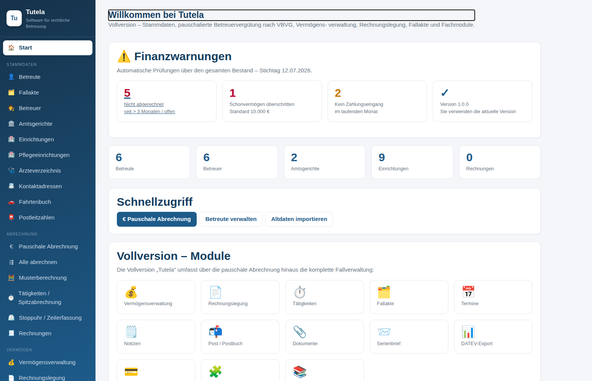
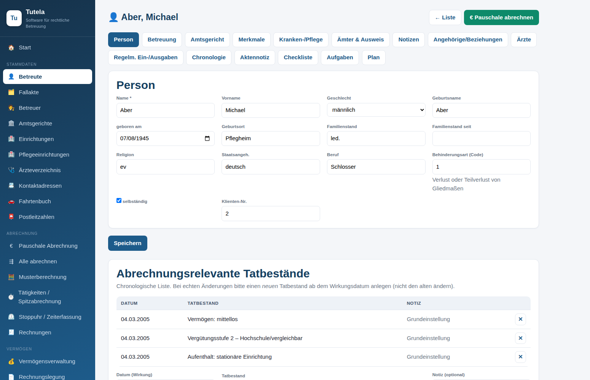
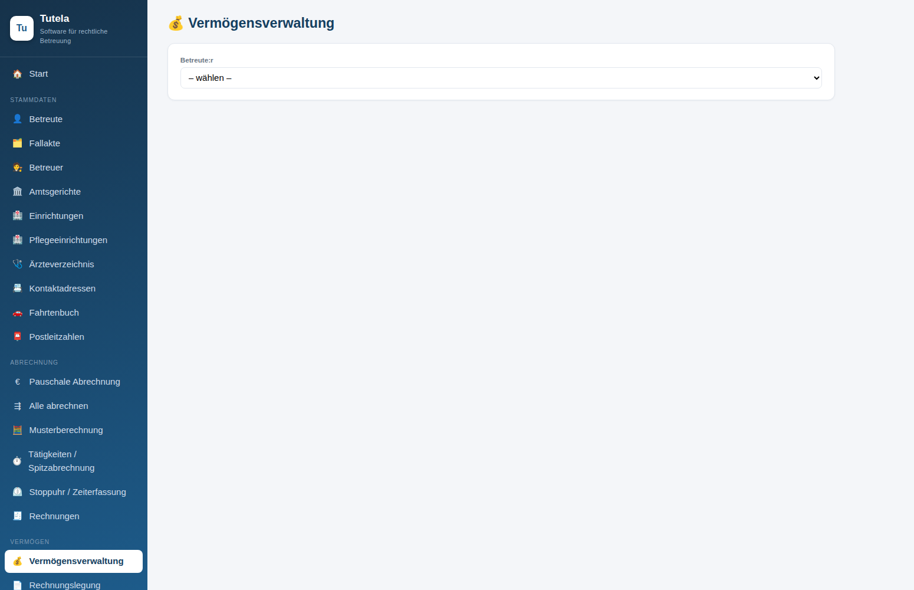
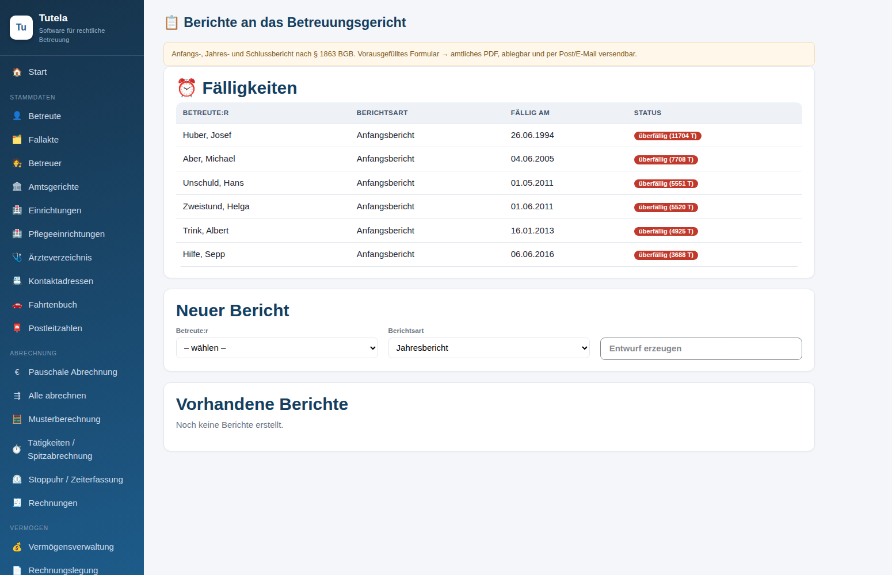
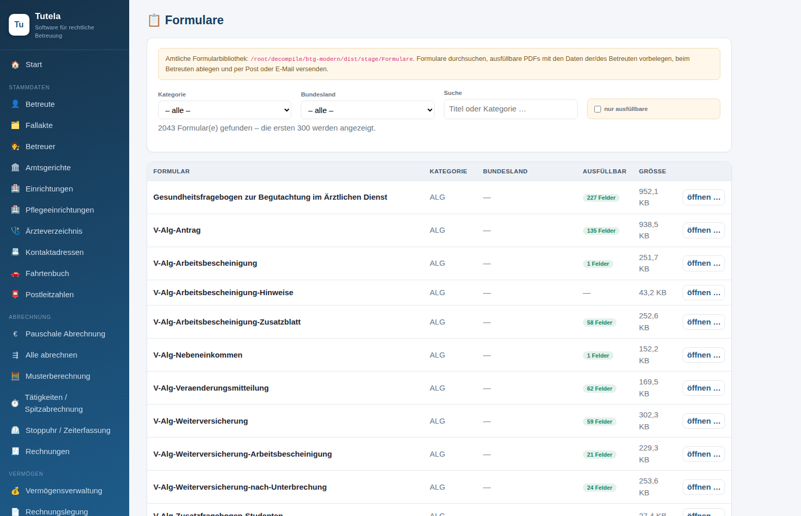
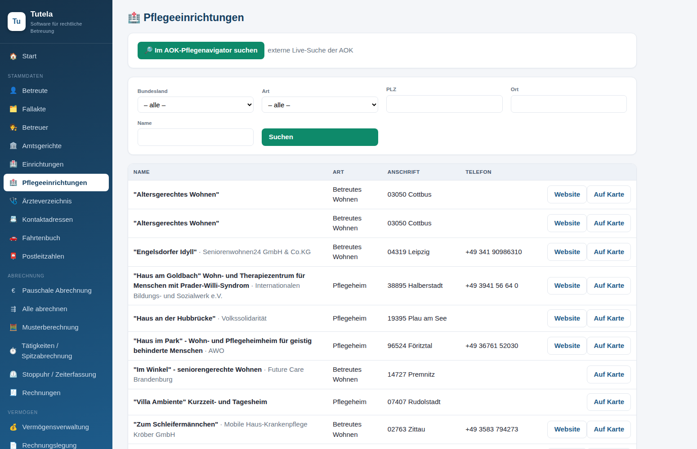
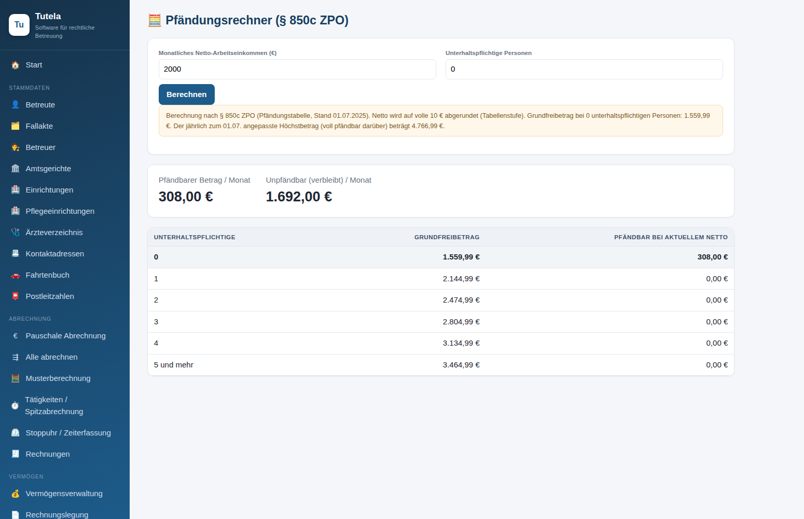
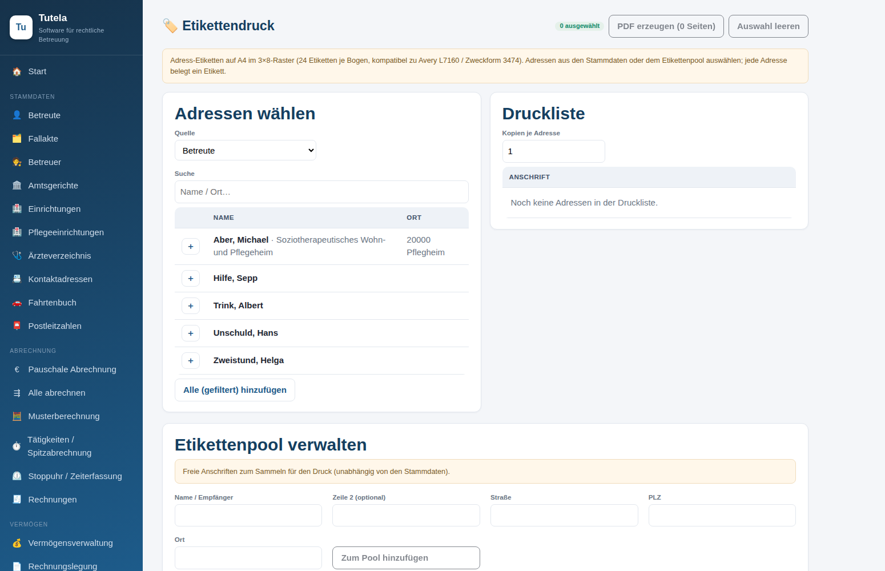

# Tutela

**Software für rechtliche Betreuung**
Betreuung · Vergütung · Vermögen — modern, lokal, sicher.

.NET 10 · Blazor Server · verschlüsselte lokale Datenbank (SQLCipher) · Windows

---

## Was ist Tutela?

**Tutela** ist eine vollständig neu entwickelte, moderne Fach­software für **rechtliche Betreuer:innen** (Berufs- und Vereinsbetreuung). Sie bildet den kompletten Arbeitsalltag ab – von der Betreutenakte über die pauschale und Spitz-Vergütung nach VBVG, die Vermögensverwaltung mit gerichtsfester Rechnungslegung, die Berichte ans Betreuungsgericht bis hin zur amtlichen Formularbibliothek.

Tutela läuft **lokal auf Ihrem eigenen Rechner** (selbst-gehostet, keine Cloud). Alle Daten liegen in einer **verschlüsselten** Datenbank auf Ihrem PC. Bestehende Datenbestände der Alt-Software lassen sich per **DBF-Import** übernehmen.

> **Hinweis:** Tutela ist eine unabhängige Neuentwicklung für lizenzierte Anwender:innen, die von der eingestellten Visual-FoxPro-Alt­software umsteigen. Es ist **keine** Fortführung und steht in keiner Verbindung zum ursprünglichen Hersteller. Fachliche Berechnungen folgen dem Gesetz (VBVG, BGB, KostBRÄG); es wird keine Rechtsberatung geleistet und keine Gewähr übernommen.

---

## Download & Installation

**➡ [Tutela herunterladen](https://showroom.dzeksn.com/s/tutela)**

**➡ [Tutela herunterladen](https://showroom.dzeksn.com/s/tutela-portable)**

Das Paket enthält:

| Bestandteil | Zweck |
|---|---|
| **Tutela-Setup.exe** | Windows-Installer (Startmenü- + Desktop-Verknüpfung, Deinstaller) |
| **Tutela-portable.zip** | Ohne Installation – entpacken und `Tutela.exe` starten (USB-Stick-tauglich) |
| **Anleitung.pdf** | Bebilderte Schritt-für-Schritt-Anleitung für Endanwender |
| **Formularbibliothek** | Die komplette amtliche Vorlagensammlung (über 2000 PDF-Formulare) |
| **Beispieldaten** | Zum gefahrlosen Ausprobieren |

**Systemvoraussetzung:** Windows 10/11 (64-Bit). Es ist **kein** vorinstalliertes .NET nötig – die Laufzeit ist enthalten (self-contained).

Nach dem Start öffnet sich Tutela im Browser unter `http://127.0.0.1:5199`. Die Anwendung läuft ausschließlich auf Ihrem Rechner.

---

## Funktionsumfang

### 👤 Stammdaten & Fallmanagement
- **Betreute** mit vollständiger Fallakte (Aufgabenkreise, Gericht, Aktenzeichen, Angehörige, Bankverbindungen)
- **Betreuer**, **Einrichtungen/Heime**, **Amtsgerichte** (659 Gerichte mit Adressen bereits hinterlegt)
- Autovervollständigung: IBAN → Bank/BIC (3.514 Banken), PLZ → Ort (46.487 Orte)

### 🏥 Verzeichnisse (bereits hinterlegt, nach Bundesland durchsuchbar)
- **Pflegeeinrichtungen** – über 8.400 Heime, Pflegedienste, Tagespflegen & Kliniken bundesweit, filterbar nach Bundesland/PLZ/Ort/Art, mit Website- und Karten-Link sowie „Im **AOK-Pflegenavigator** suchen"
- **Ärzteverzeichnis** – tausende Praxen mit Adresse & Kontakt (Datenbasis: OpenStreetMap), filterbar nach Fachrichtung/Ort, mit direktem Sprung in die **KBV-Arztsuche (116117)**

### 💶 Vergütung & Abrechnung
- **Pauschale Betreuervergütung** nach **VBVG §§ 7–10** – Fallpauschalen mit Betreuungsmonaten (§§ 187/188 BGB), aktuelle Sätze (KostBRÄG 2025 / 2026)
- **Alle abrechnen** – Stapelabrechnung fälliger Betreuungen
- **Musterberechnung** zum Durchspielen
- **Tätigkeiten & Spitzabrechnung** (Stundensätze, Auslagen, Fahrten)
- **⏱ Stoppuhr / Zeiterfassung** – Gespräche live stoppen; die erfasste Zeit fließt direkt in die Spitzabrechnung ein
- **Rechnungen** mit konfigurierbarer Nummerierung

### 💰 Vermögen & Rechnungslegung
- **Vermögensverwaltung** (Konten, Bargeld, Sparvermögen, Wertpapiere, Verbindlichkeiten)
- **Rechnungslegung (§ 1865 BGB)** mit gerichtsfester Prüfidentität `Endbestand = Anfang + Einnahmen − Ausgaben + Umbuchungen`
- **Vermögensverzeichnis (§ 1835 BGB)** zum Stichtag
- **DATEV-Export** (EXTF-Buchungsstapel)

### 📄 Berichte ans Betreuungsgericht
- **Anfangs-, Jahres- und Schlussbericht (§ 1863 BGB)** – strukturiertes, vorausgefülltes Formular → amtlich wirkendes PDF
- Fristenüberwachung (fällig / überfällig), Vermögensverzeichnis als Beilage

### ✉️ Kommunikation & Dokumente
- **Briefe** & **Serienbrief** mit Vorlagen (31 Brief­vorlagen)
- **📑 Formulare** – die **komplette amtliche Formularbibliothek des Originals** (über 2000 PDFs, nach Kategorie & Bundesland durchsuchbar): Formulare **vorausfüllen**, **ablegen/speichern**, **per Post** und **per E-Mail** versenden – wie im Original
- **Dokumentenablage** je Betreutem
- **E-Mail (SMTP)** – mit wählbarer Verschlüsselung: **keine / SSL-TLS / STARTTLS** (sicherer Versand von PDFs und Formularen)
- **Deutsche Post** (Hybridbrief / E-POST) für den physischen Versand

### 🗂 Organisation & Fachmodule
- **Termine**, **Notizen**, **Postbuch/Posteingang**
- **Schulden / Insolvenz** und **Sucht-KDS** (vollständige Codebücher)
- **Altakten**-Verwaltung

### 🔒 Verwaltung, Sicherheit & Fernzugriff
- **Verschlüsselte Datenbank** (SQLCipher), optionaler **Passwortschutz**
- **Datenimport** aus der Alt-Software (DBF/FPT) und **Datensicherung**
- **🌐 Fernzugriff (VPN/RDP)** – WireGuard-Konfiguration erzeugen und Verbindung zum eigenen VPS herstellen, anschließend Zugriff per RDP *(setzt einen installierten WireGuard-Client + Administratorrechte voraus – Tutela erzeugt die Konfiguration und startet die Windows-Werkzeuge)*

---

## Screenshots

| Startseite mit Warnmeldungen | Betreutenakte (alle Reiter) |
|---|---|
|  |  |

| Vermögen & Rechnungslegung | Berichte ans Gericht |
|---|---|
|  |  |

| Formularbibliothek (2047 PDFs) | Pflegeeinrichtungen (nach Bundesland) |
|---|---|
|  |  |

| Pfändungsrechner (§ 850c ZPO) | Etikettendruck |
|---|---|
|  |  |

---

## Datenübernahme aus der Alt-Software

1. In Tutela **Verwaltung → Datenimport** öffnen.
2. Den Ordner mit den `*.DBF`/`*.FPT`-Dateien der Alt-Software wählen.
3. Import starten – Betreute, Konten, Buchungen, Tätigkeiten, Termine u. v. m. werden übernommen.

Geldbeträge werden 1:1 übernommen; berechnete Kontostände werden gegen die gespeicherten Stände geprüft.

---

## Technik

| | |
|---|---|
| **Plattform** | .NET 10, Blazor Server (InteractiveServer) |
| **Datenbank** | SQLite + **SQLCipher** (verschlüsselt), EF Core 9 |
| **PDF** | QuestPDF (Erzeugung) · PdfSharp (Formulare/AcroForm) |
| **E-Mail** | MailKit (SMTP, TLS/STARTTLS) |
| **Betrieb** | lokal, Loopback `127.0.0.1:5199`, ein Prozess/ein Nutzer |

---

## Datenschutz

Tutela verarbeitet besonders schützenswerte Daten. Deshalb:
- **Keine Cloud, keine Telemetrie** – alles bleibt auf Ihrem Gerät.
- Die Datenbank ist **verschlüsselt**; unter Windows wird der Schlüssel zusätzlich per DPAPI geschützt.
- Der Zugang lässt sich mit einem Passwort absichern.

---

**[⬇ Jetzt Installer herunterladen](https://showroom.dzeksn.com/s/tutela)**

**[⬇ Jetzt Portable herunterladen](https://showroom.dzeksn.com/s/tutela-portable)**

Tutela · Software für rechtliche Betreuung

